# Adept Trackball - QMK/VIA Custom Firmware 

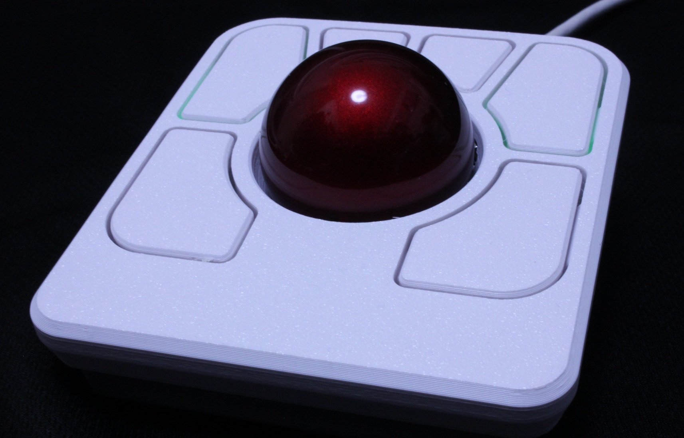

Ploopy Adept Trackballをベースに、[こちら](https://nyanz-lab.booth.pm/)で販売しているAdept Trackball向けにカスタマイズしたQMK/VIAファームウェアです。
本ファームウェアは、LEDなしの標準モデルと、LEDを搭載したカスタムモデルの両方に対応しています。

## WebHIDによる各種設定

本ファームウェアでは、以下のWebHIDを使用して、ブラウザからAdept Trackballの各種設定を変更できます。

### Ploopy Adept 総合コントローラー

https://nyanz-lab.github.io/adept-trackball-custom/

ブラウザからAdept Trackballを接続することで、以下のような設定を変更できます。
- DPI
- ポーリングレート
- センサーの角度補正
- スクロール関連設定
- ボタン関連設定
- LED関連設定（LED搭載モデル）
- PMW3360の設定・診断
詳しくは総合コントローラーの各設定画面を参照してください。

## キーマップについて

本ファームウェアでは、[VIA](https://usevia.app/)を用いてキーマップの確認と変更ができます。
以下はデフォルトのキーマップです。

【VIAキーマップ画像】
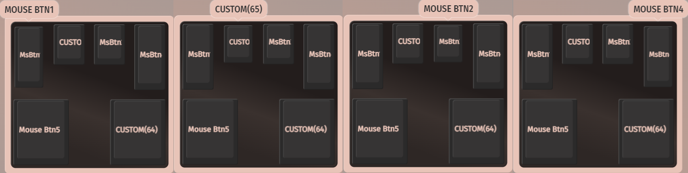

## DPI・Drag Scrollのキー割り当てについて

本ファームウェアでは、DPI切り替えおよびDrag Scrollを独自に処理しています。
そのため、VIAに用意されている標準のDPIキーやDrag Scrollキーではなく、以下のCustomキーを使用してください。

- CUSTOM(64)：Drag Scroll
- CUSTOM(65)：DPI切り替え

VIAのSPECIAL → CUSTOMから該当するキーを選択し、任意のキーに割り当ててください。

【VIAでのキー割り当て画面】
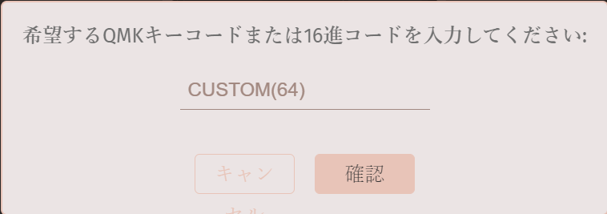

## RGBライティングについて

LED搭載モデルでは、基板上の2個のRGB LEDを使用して、トラックボールの状態を表示します。

- レイヤー0：消灯
- レイヤー1以降：レイヤーに応じた色で点灯

DPI切り替え時やDrag Scroll使用時にもLEDで状態を表示します。
LEDの表示はファームウェアによって制御されます。

## ファームウェアについて

本ファームウェアは、標準モデル・LED搭載モデルのどちらでも使用できます。
今後販売するAdept Trackballには、本ファームウェアを標準で使用します。
すでにAdept Trackballを購入されている方も、本ファームウェアを使用できます。

本ファームウェアの使用は必須ではありません。必要に応じて、Ploopy公式のファームウェアや以前のカスタムファームウェアに戻すこともできます。

### ファームウェアのダウンロード

標準モデル・LED搭載モデルともに同じファームウェアを使用します。

使用するファームウェア：
[ploopyco_madromys_rev1_001_nyanz-lab_v1.1.0.uf2](https://github.com/nyanz-lab/adept-trackball-custom/blob/main/firmware/ploopyco_madromys_rev1_001_nyanz-lab_v1.1.0.uf2)

### ファームウェアの書き込み

本デバイスはRP2040に搭載されているUF2ブートローダーを使用しています。

#### ブートローダーモードへの入り方

左下ボタンを押しながらUSBケーブルを接続すると、ブートローダーモードで起動します。

ブートローダーモードでは通常のマウスとして動作せず、PC上に「RPI-RP2」などのUF2ドライブが表示されます。

#### ファームウェアの書き込み

表示されたUF2ドライブに、ダウンロードした.uf2ファイルをドラッグ＆ドロップしてください。

書き込みが完了すると自動的に再起動し、通常の動作に戻ります。

## 参考資料
### LEDカスタムモデル
#### ライティング画像
起動時（デフォルトレイヤー）は光りません。
- レイヤー1
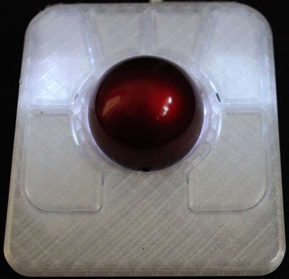
- レイヤー2
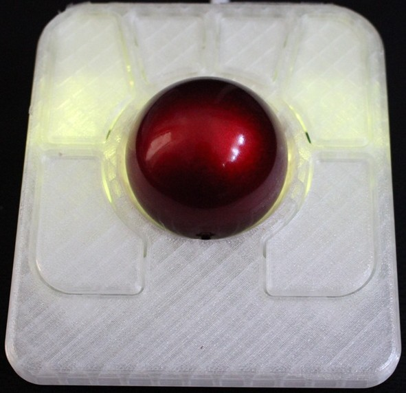
- レイヤー3
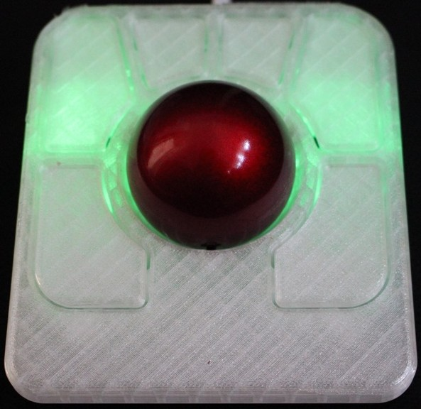
- レイヤー4
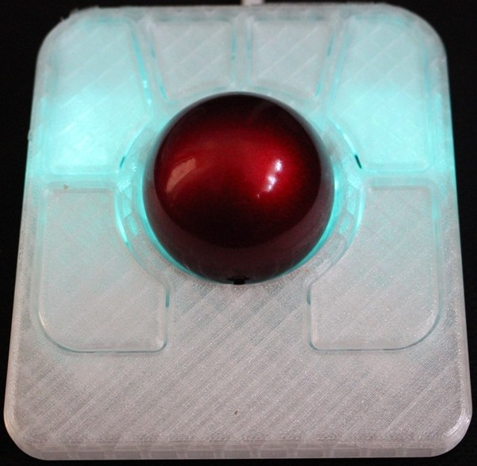
- レイヤー5
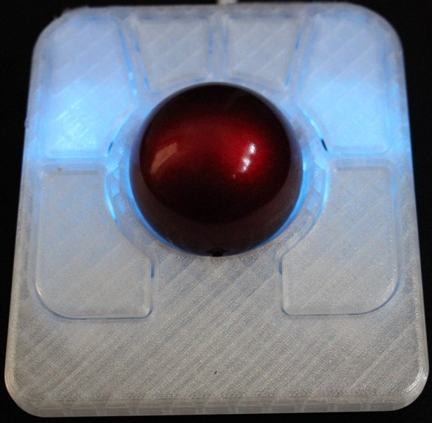
- レイヤー6
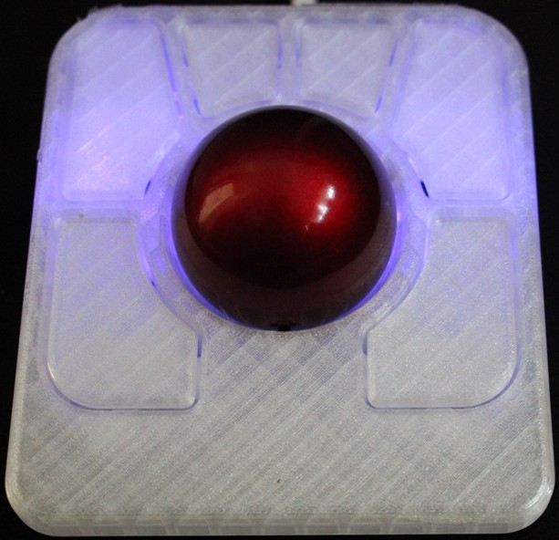
- レイヤー7
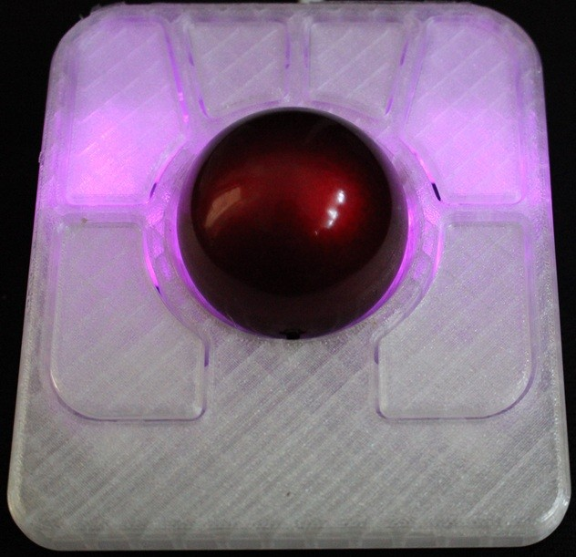
- ドラッグスクロール  
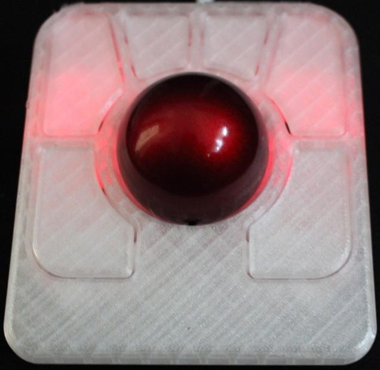

### PCB画像
- 表面  
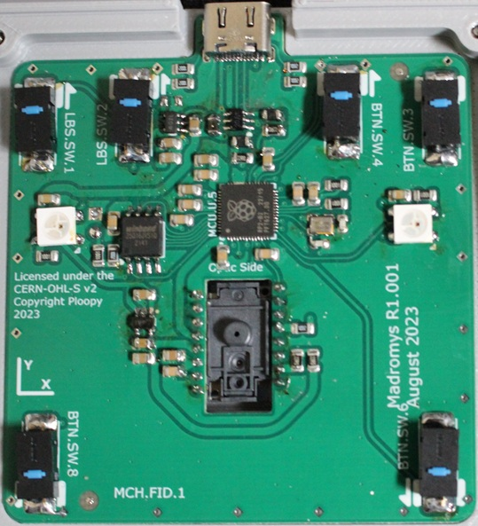
- 裏面  
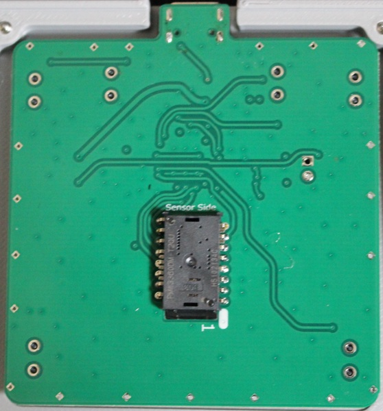
